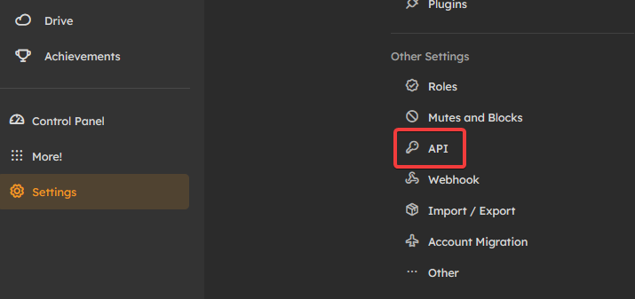

# Getting Ready to Use Cardboard 📦
Welcome to Cardboard! If you're new to programming, then it can be a daunting task to set up a bot. But, we have your back!

> ℹ️ You should keep in mind, screenshots are taken from Sharkey - a soft fork of Misskey. Things may look a bit different on your instance.

## Preparing your environment
While we're still working on getting Cardboard to 100%, you'll need to use a Typescript-friendly compiler. In this instance, we recommend Bun for this task!

We assume you already have NodeJS installed. To install bun, run this command:
```bash
$ npm install -g bun
$ bun init
```

once complete, you can now initialize bun, and run cardboard!
```bash
$ bun init
$ bun add @kitsu-org/cardboard
```


## Getting an API Key
When using *Key for programmatic access, there's a couple things you should keep in mind.
1. If the user is only controlled by a bot, it should have the "is a bot?" setting set to true.
2. Most users shouldn't share control of an account _with_ a bot. (Especially if you're an admin.)

To get an API key, go to [Settings], then [API Key].


Then, you can [Generate access token]. Give it a memorable name, and offer it the permissions you want.

> **Keep in mind**... The bare minimum permission that Cardboard needs is 
> "View your account information". This is because an authentication check is reliant on it.

In this case, if your bot is messaging users pictures for example, you'll need:
- View your Account information
- Access your Drive files and folders
- Edit or delete your Drive files and folders
- Compose or delete notes

## Making your first program
Now that you have a key, and you have your environment setup, we're going to make a ping-pong bot. Essentially, when your bot receives a message that says "ping", it'll respond "pong!"

First, make a file in your root called ``.env``. we'll store your API key here.

```env
API_KEY=YourAwesomeApiKeyGoesHere
INSTANCE=YourInstanceGoes.Here
```
Now that you have put your keys into a .env file, you can open up the ``index`` file.

```ts
import { CardboardClient } from '@kitsu-org/cardboard';
const cardboard = new CardboardClient(bun.env.INSTANCE, bun.env.API_KEY);

// We should know when Cardboard is ready for commands!
// This'll let us know.
cardboard.on("ready", async () => {
    cardboard.log("Ready!")
});

//When someone mentions us, we'll take the mention out of the text, then we'll see if it equals to "ping". If it does, we'll say pong!
cardboard.on("mention", async (msg) => {
    if (
        msg.note.text
            ?.replaceAll(`@${(await cardboard.getSelf()).user.username} `, "") === "ping"
    ) {
        await msg.reply("Pong!");
    }
});

cardboard.connect();
```

All there's left is just to ``bun run`` and you're now running your first ever bot with cardboard! 👏